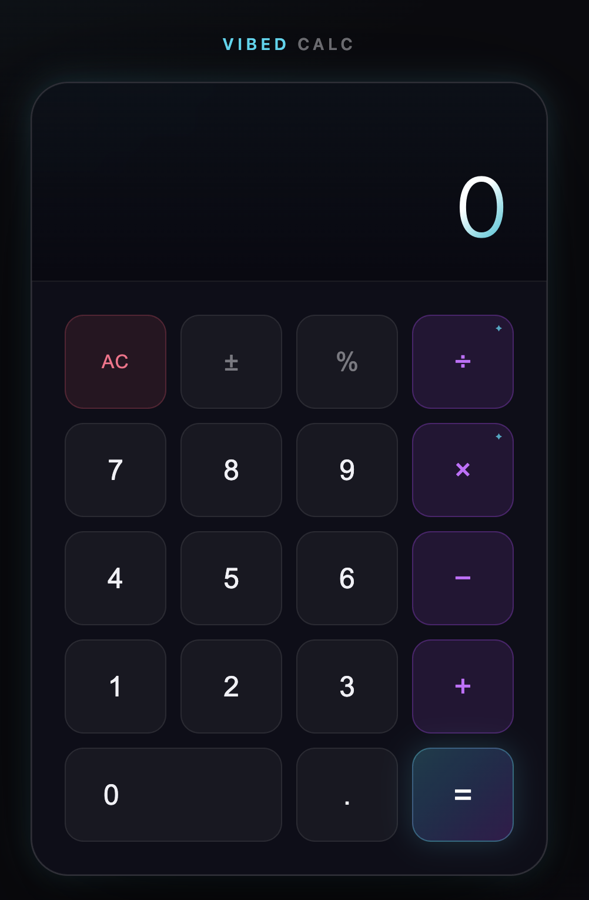

<div align="center">



# Vibed Calc

**A calculator for the basics. A subscription for the rest.**

[](https://guicheffer.github.io/vibedcalc-subscription/)
[](https://guicheffer.github.io/vibedcalc-subscription/presentation.html)
[](#)
[](#)

</div>

---

Addition and subtraction — free, forever. Multiplication, division, and the operations we haven't invented yet? Those are for subscribers.

→ **[Open the calculator](https://guicheffer.github.io/vibedcalc-subscription/)**
→ **[Understand the factory process](https://guicheffer.github.io/vibedcalc-subscription/presentation.html)**

## What's free

| Operation | Status |
|---|---|
| `+` Addition | ✅ Free |
| `−` Subtraction | ✅ Free |
| `×` Multiplication | 🔒 Premium — Soon™ |
| `÷` Division | 🔒 Premium — Soon™ |
| `xⁿ` Exponentiation | 🗺 Roadmap |
| `∞` Imaginary Ops | 🗺 Roadmap |

## How it was built

Two features shipped through a three-station AI factory:

```
/planner <idea>   →  Bean with ## High-Level Plan
/refine <id>      →  Bean with ## Refined Plan  (file paths, signatures, test sketch)
/implement <id>   →  branch + commits + ## Implementation Log
```

Each station passes a **Bean** — a structured markdown artifact managed by the [`beans` CLI](https://github.com/hmans/beans). The headings are exact-match contracts. Rename one, break the next.

**Feature 1 — `subscalc-uizf`:** Glassmorphism dark UI, free ops wired, premium keys rendered but inactive.

**Feature 2 — `subscalc-1y0l`:** Subscription modal fires on `=` when the expression contains a premium op. Visual overhaul. Cmd/Ctrl keyboard guard.

## Factory guardrails

- **Trace hook** — every run appends a JSON line to `runs/trace.jsonl`
- **Path guard** — `guard-paths.sh` blocks `/implement` if any path in the Refined Plan doesn't exist
- **Evals** — `eval-kit/check.sh` runs 4 checks on any bean: plan altitude, refined plan present, real acceptance criteria, paths exist

```bash
bash eval-kit/check.sh eval-kit/beans/good-bean.md   # all PASS
bash eval-kit/check.sh eval-kit/beans/broken-bean.md # three FAIL
```

## Run locally

```bash
npm install
npm run build   # tsc --noEmit
npm test        # vitest run — 6 tests
npm start       # opens index.html in browser
```

---

<div align="center">
<sub>Built at αlphalist Developer Bootcamp · Hamburg 2026</sub>
</div>
